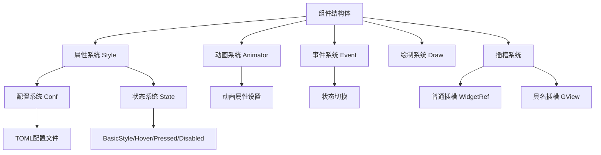
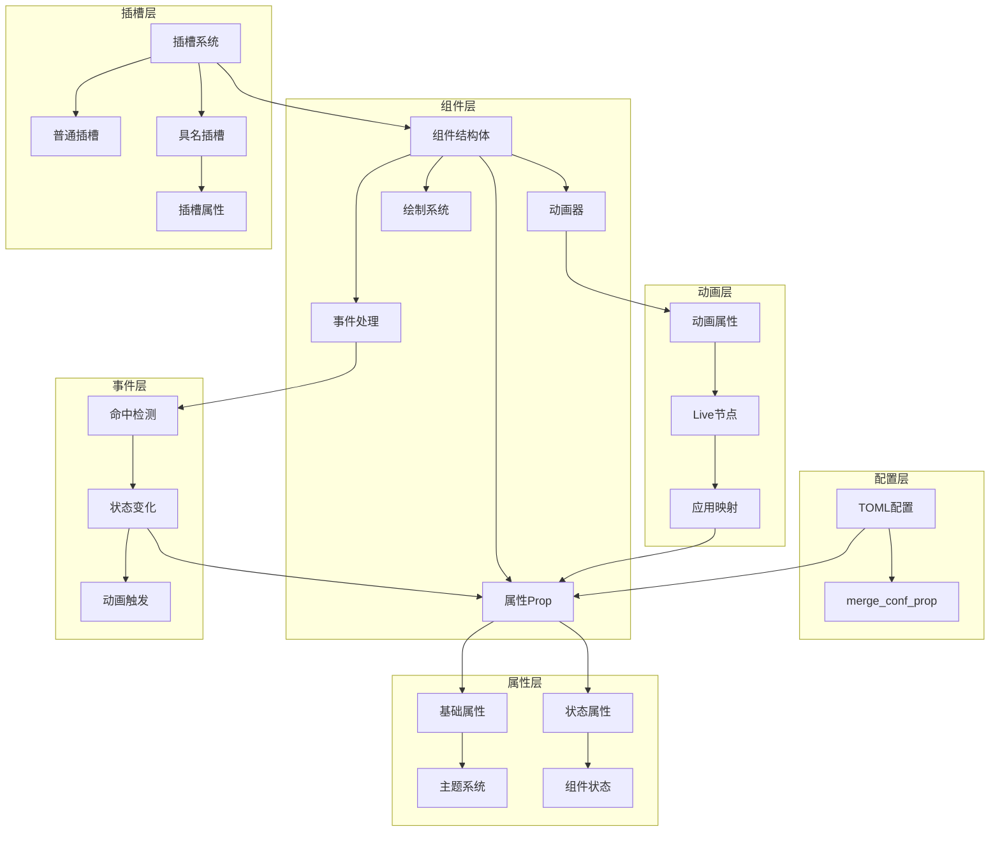

# GenUI 组件设计文档

## 概述

GenUI 是一个基于 Makepad 框架的现代化 UI 组件库。本文档详细介绍了组件的设计模式、架构关系和实现原则，旨在帮助开发者快速理解和使用该组件库。

## 组件分类

GenUI 将组件分为三大类，每类都有特定的用途和实现模式：

### 1. 普通组件 (Ordinary Components)
**代表：Label 组件**

**特点：**
- 无插槽，直接渲染自身内容
- 结构简单，专注于单一功能
- 适用于文本显示、图标等基础元素

**结构示例：**
```rust
#[derive(Live, WidgetRef, WidgetSet, LiveRegisterWidget)]
pub struct GLabel {
    #[live] pub style: LabelProp,
    #[live] pub draw_text: DrawText,
    #[rust] pub state: LabelState,
}
```

### 2. 非具名插槽组件 (Unnamed Slot Components)
**代表：Button 组件**

**特点：**
- 包含一个通用插槽 `slot`
- 可以在插槽中放置任意内容
- 适用于按钮、输入框等需要包装内容的组件

**结构示例：**
```rust
#[derive(Live, WidgetRef, WidgetSet, LiveRegisterWidget)]
pub struct GButton {
    #[live] pub style: ButtonProp,
    #[live] pub draw_button: DrawButton,
    #[live] pub slot: WidgetRef,
    #[rust] pub state: ButtonState,
}
```

### 3. 具名插槽组件 (Named Slot Components)
**代表：Card 组件**

**特点：**
- 包含多个具名插槽（如 header、body、footer）
- 每个插槽都有特定语义和用途
- 适用于复杂布局的组件

**结构示例：**
```rust
#[derive(Live, WidgetRef, WidgetSet, LiveRegisterWidget)]
pub struct GCard {
    #[live] pub style: CardStyle,
    #[live] pub header: GView,
    #[live] pub body: GView,
    #[live] pub footer: GView,
    #[rust] pub state: CardState,
}
```

## 核心架构关系

### 组件核心关系图



### 详细交互关系图



## 核心关系说明

### 1. 组件 ↔ 属性系统
- 组件通过 `style: ComponentStyle` 持有所有样式属性
- 属性分为四种状态：`basic`、`hover`、`pressed`、`disabled`
- 每个状态包含完整的 `BasicStyle`（基础属性）

### 2. 属性 ↔ 配置系统
- `merge_conf_prop()` 方法从全局配置合并属性
- 配置存储在 `cx.global::<Conf>()` 中
- 支持运行时动态配置更新

### 3. 属性 ↔ 动画系统
- 使用 `set_animation!` 宏建立动画属性映射
- 动画值存储在 `ApplyStateMap` 或 `ApplySlotMap` 中
- `sync()` 方法将动画值同步到组件属性

### 4. 属性 ↔ 事件系统
- 事件触发状态切换：`switch_state()`
- 状态变化自动更新对应属性
- 支持带动画的状态切换

### 5. 组件 ↔ 插槽系统
- **普通插槽**：`slot: WidgetRef`，可放置任意内容
- **具名插槽**：`header: GView`、`body: GView` 等，特定用途
- 插槽属性通过 `SlotStyle` 和 `SlotBasicStyle` 管理

## 设计原则

### 1. 状态驱动设计
```rust
// 状态决定当前使用的属性
let style = self.style.get(self.state);

// 事件改变状态
self.switch_state(ButtonState::Pressed);

// 状态变化触发重绘
self.redraw(cx);
```

### 2. 配置优先原则
```rust
// 配置覆盖默认值，确保一致性
fn merge_conf_prop(&mut self, cx: &mut Cx) {
    let conf_prop = &cx.global::<Conf>().components.button;
    self.style = conf_prop.clone();
}
```

### 3. 动画集成原则
```rust
// 动画值实时同步到组件属性
set_animation! {
    nodes: draw_button = {
        color => prop.color,
        background_color => prop.background_color
    }
}
```

### 4. 插槽抽象原则
```rust
// 普通插槽 - 灵活性高
#[live] pub slot: WidgetRef

// 具名插槽 - 语义明确
#[live] pub header: GView
#[live] pub body: GView
#[live] pub footer: GView
```

## 实现模式详解

### 普通组件实现模式 (Label)

```rust
impl Component for GLabel {
    fn render(&mut self, cx: &mut Cx) -> Result<(), Self::Error> {
        // 同步属性到绘制对象
        self.draw_text.color = self.style.get(self.state).color;
        self.draw_text.text_style.font_size = self.style.get(self.state).font_size;
        Ok(())
    }
}

impl Widget for GLabel {
    fn draw_walk(&mut self, cx: &mut Cx, scope: &mut Scope, walk: Walk) -> DrawStep {
        // 直接绘制自身
        self.draw_text.draw_walk(cx, scope, walk)
    }
}
```

### 非具名插槽组件实现模式 (Button)

```rust
impl Component for GButton {
    fn render(&mut self, cx: &mut Cx) -> Result<(), Self::Error> {
        // 同步属性
        self.draw_button.merge(&self.style.get(self.state));
        Ok(())
    }
}

impl Widget for GButton {
    fn draw_walk(&mut self, cx: &mut Cx, scope: &mut Scope, walk: Walk) -> DrawStep {
        // 先绘制按钮背景
        self.draw_button.draw_walk(cx, scope, walk)?;
        
        // 再绘制插槽内容
        self.slot.draw_walk(cx, scope, walk)
    }
}
```

### 具名插槽组件实现模式 (Card)

```rust
impl SlotComponent for GCard {
    fn render_slots(&mut self, cx: &mut Cx) -> Result<(), Self::Error> {
        // 同步插槽属性
        self.header.apply_slot_prop(cx, &self.style.get(self.state).header);
        self.body.apply_slot_prop(cx, &self.style.get(self.state).body);
        self.footer.apply_slot_prop(cx, &self.style.get(self.state).footer);
        Ok(())
    }
}

impl Widget for GCard {
    fn draw_walk(&mut self, cx: &mut Cx, scope: &mut Scope, walk: Walk) -> DrawStep {
        // 依次绘制各个具名插槽
        self.header.draw_walk(cx, scope, walk)?;
        self.body.draw_walk(cx, scope, walk)?;
        self.footer.draw_walk(cx, scope, walk)
    }
}
```

## 属性系统详解

### 属性结构层次
```
ComponentProp {
    basic: ComponentBasicStyle {
        component_part: ComponentPartProp,  // 组件特定属性
        container: ViewBasicStyle,          // 容器属性
    },
    hover: ComponentBasicStyle { ... },
    pressed: ComponentBasicStyle { ... },
    disabled: ComponentBasicStyle { ... },
}
```

### 属性继承宏
```rust
inherits_view_basic_prop!{
    ComponentPartProp {
        border_width: 0.0,
        background_visible: true,
        // ... 其他属性
    }, ComponentState, "component.container"
}
```

## 动画系统详解

### 动画设置模式
```rust
set_animation! {
    nodes: draw_component = {
        color => prop.color,
        background_color => prop.background_color,
        border_width => prop.border_width
    }
}
```

### 状态动画切换
```rust
// 带动画的状态切换
self.switch_state_with_animation(cx, ButtonState::Hover, AnimationType::EaseInOut);

// 立即状态切换
self.switch_state(ButtonState::Pressed);
```

## ⚡ 事件系统详解

### 事件处理流程
```rust
fn handle_event(&mut self, cx: &mut Cx, event: &Event, scope: &mut Scope) -> EventAction {
    match event {
        Event::Actions(actions) => {
            // 处理命中事件
            if let Some(hit) = actions.find_hit(cx, scope, self.draw_button.area()) {
                match hit.action {
                    ButtonAction::Pressed => {
                        self.switch_state(ButtonState::Pressed);
                        return EventAction::Consumed;
                    }
                    ButtonAction::Released => {
                        self.switch_state(ButtonState::Hover);
                        // 触发点击事件
                        cx.widget_action(self.widget_uid(), &scope.path, ButtonEvent::Clicked);
                        return EventAction::Consumed;
                    }
                }
            }
        }
    }
    EventAction::None
}
```

## 最佳实践

### 1. 属性设计
- 使用宏继承 `ViewBasicStyle` 避免 live reload 问题
- 为每个状态定义完整的属性集合
- 使用 `from_live_value()` 进行类型转换

### 2. 组件实现
- 始终实现 `Component` trait
- 具名插槽组件额外实现 `SlotComponent` trait
- 在 `render()` 中同步属性到绘制对象

### 3. 事件处理
- 使用 `find_hit()` 检测组件区域内的点击
- 状态变化后调用 `redraw()` 触发重绘
- 重要事件通过 `widget_action()` 向父组件传递

### 4. 插槽管理
- 普通插槽使用 `WidgetRef`
- 具名插槽使用 `GView`
- 插槽属性通过 `apply_slot_prop()` 应用

## prompt

### prop.rs
接下来让我来指导你更改tag的prop.rs, 让我们以tabbar_item的prop作为蓝本，说明和分析一下你写的代码的不足和错误的地方
1. tag和tabbar_item一样都是带有插槽的，tag有左侧的icon插槽，中间的text文字插槽和右侧的关闭图标的插槽，这里的插槽都是具名插槽(具体插槽)，对于有插槽的组件都会使用SlotStyle trait处理顶层Prop，也就是impl SlotStyle for TagProp，然后会使用component_part!宏来创建组件结构，这里就会含有Container，Icon, Text, Close四个。
2. 插槽组件使用TagBasicStyle来声明具体插槽属性，由于这些插槽已经是基本组件了，并且可以直接获取插槽的BasicStyle，所以需要让TagBasicStyle来实现BasicStyle和SlotBasicStyle trait
3. set_from_str方法中都可以使用属性类型的from_live_value().unwrap_or来设置，这里我已经改了
4. 你的 TagBasicStyle声明是完全错误的，应该像TabbarItemBasicStyle那样进行声明

### mod.rs
让我指导你写组件的具体实现mod.rs，我们参考tabbar_item的mod.rs
1. 首先在定义结构体的时候这里selected是不需要的，因为只有disabled需要对应状态，然后是apply_state_map, 对于带有插槽的组件应该使用apply_slot_map，我还看到你声明了一个slot，这个也是不需要的，因为其他icon,text,close已经完整的包含了Tag需要的插槽
2. 然后是WidgetNode这个trait的实现，你只需要记住一个原则，只要不包含GView这样的容器型插槽，那么就可以直接返回WidgetRef::empty()，find_widgets也是，可以直接写个()表示无执行，walk方法直接获取prop的container的walk()即可，因为walk方法就是在设置外层容器，redraw方法则需要对插槽是否可见进行判断，插槽也需要redraw，同时redraw方法前需要使用render方法，但仅限当前组件，意思是不需要调用插槽的render方法。需要补充visible!宏生产需要的方法，需要实现state方法，固定为self.state.to_string()
3. 同样draw_walk, handle_event都可以直接参考
4. 然后就是LiveHook trait需要实现，直接参考就行，实现非常固定
5. 所有组件都需要实现Component trait
6. 带有插槽的组件需要额外实现SlotComponent trait
请对照进行修改
